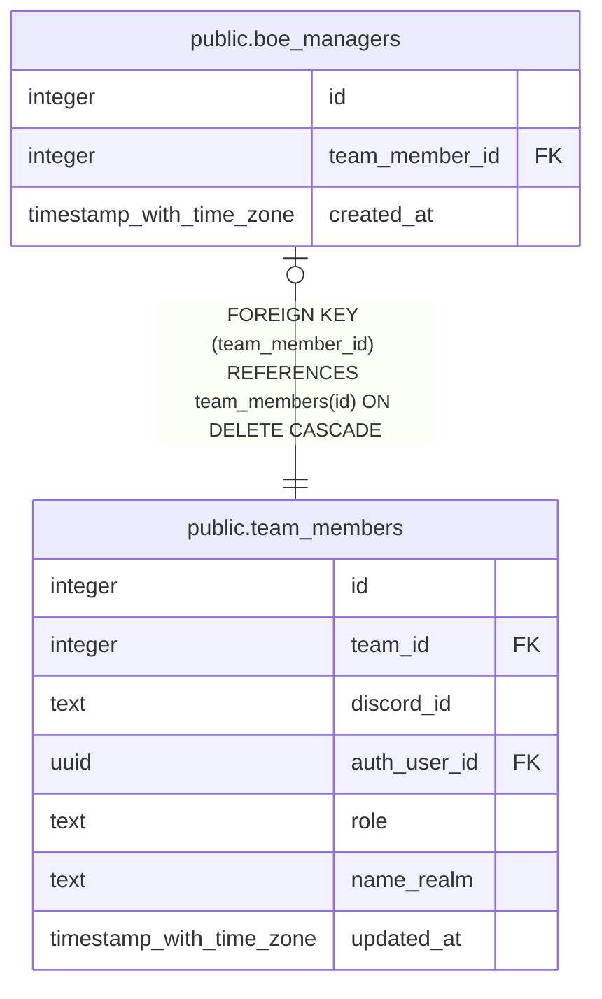

# public.boe_managers

## Columns

| Name | Type | Default | Nullable | Children | Parents | Comment |
| ---- | ---- | ------- | -------- | -------- | ------- | ------- |
| id | integer | nextval('boe_managers_id_seq'::regclass) | false |  |  |  |
| team_member_id | integer |  | false |  | [public.team_members](public.team_members.md) |  |
| created_at | timestamp with time zone | now() | false |  |  |  |

## Constraints

| Name | Type | Definition |
| ---- | ---- | ---------- |
| boe_managers_team_member_id_fkey | FOREIGN KEY | FOREIGN KEY (team_member_id) REFERENCES team_members(id) ON DELETE CASCADE |
| boe_managers_pkey | PRIMARY KEY | PRIMARY KEY (id) |
| boe_managers_team_member_id_key | UNIQUE | UNIQUE (team_member_id) |

## Indexes

| Name | Definition |
| ---- | ---------- |
| boe_managers_pkey | CREATE UNIQUE INDEX boe_managers_pkey ON public.boe_managers USING btree (id) |
| boe_managers_team_member_id_key | CREATE UNIQUE INDEX boe_managers_team_member_id_key ON public.boe_managers USING btree (team_member_id) |

## Relations

---

> Generated by [tbls](https://github.com/k1LoW/tbls)
