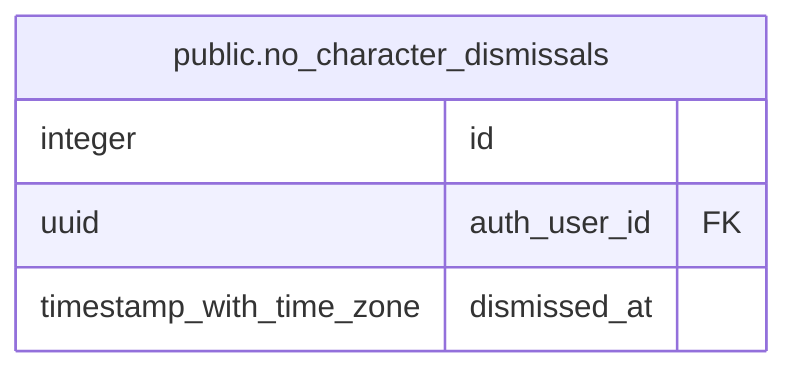

# public.no_character_dismissals

## Columns

| Name | Type | Default | Nullable | Children | Parents | Comment |
| ---- | ---- | ------- | -------- | -------- | ------- | ------- |
| id | integer | nextval('no_character_dismissals_id_seq'::regclass) | false |  |  |  |
| auth_user_id | uuid |  | false |  |  |  |
| dismissed_at | timestamp with time zone | now() | false |  |  |  |

## Constraints

| Name | Type | Definition |
| ---- | ---- | ---------- |
| no_character_dismissals_auth_user_id_fkey | FOREIGN KEY | FOREIGN KEY (auth_user_id) REFERENCES auth.users(id) ON DELETE CASCADE |
| no_character_dismissals_pkey | PRIMARY KEY | PRIMARY KEY (id) |
| no_character_dismissals_auth_user_id_key | UNIQUE | UNIQUE (auth_user_id) |

## Indexes

| Name | Definition |
| ---- | ---------- |
| no_character_dismissals_pkey | CREATE UNIQUE INDEX no_character_dismissals_pkey ON public.no_character_dismissals USING btree (id) |
| no_character_dismissals_auth_user_id_key | CREATE UNIQUE INDEX no_character_dismissals_auth_user_id_key ON public.no_character_dismissals USING btree (auth_user_id) |

## Relations

---

> Generated by [tbls](https://github.com/k1LoW/tbls)
